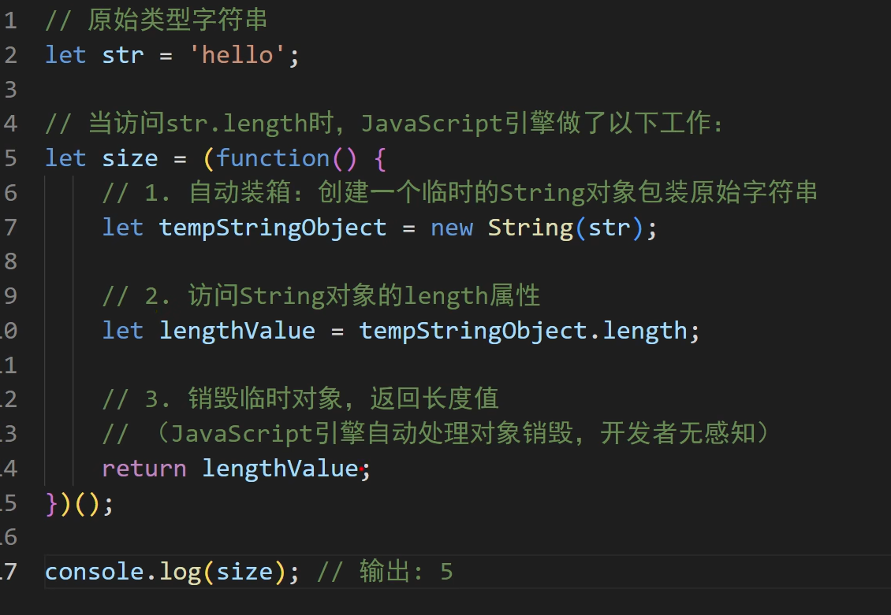

   
##  react fiber
   
   react fiber react 原有架构 状态更新是，会重新计算整个vdom， 计算完成之后才进行re-render；如果计算量很大，则会阻塞js渲染，就会是页面显示的比较卡顿
   fiber 架构的出现让计算切片，分片计算 vdom ，渲染，切片渲染。问题：切片了怎么找到父节点、兄弟节点，计算vdom时候会添加 sibling 、children，return。

一次性往页面中插入几万个dom节点，页面会卡顿一下然后一次性展示出来，使用了 requestIdlerCallback 主线程空闲的时候去执行一批任务。

## react 代码执行流程

初始化：jsx 代码会经过 babel parse 阶段 经过词法、语法分析转化为 机器可以理解的 AST，然后transform阶段 经过 jsx 的 plugin 等 转化为一颗新的 AST 转化为 React.createElement 的调用，每个标签调用一次 createElement，每个标签调用一次 方法转化为 vdom；
渲染过程 ：react 16.8之后采用 fiber 架构来生成 vdom 并完成真实dom的渲染，把 vdom 转化成成一个个的fiber，通过链表的方式串联 return、child、sibing， 通过 requestIdlerCallback 实现利用线程空余时间执行任务，达到中断的效果，实现了workLoop，循环遍历每个fiber，给fiber打上标签 update、PLACEMENT、deletion，执行对应的操作，比如插入、删除、更新，这个过程叫做调和。所有工作单位都搞定后执行 commit 操作，把vdom变化同步到真实dom；

setState 之后开始执行的流程；初始化：会把所有的 hooks 存在顶层的 wipFiber 上，setState 方法触发之后会把当前state和执行方法存入队列当中，重新设置当前工作单位为 currentRoot，然后 workLoop 重新执行，组件重新渲染，重新执行useState函数 会从 wipFiber.alternate.hooks（双缓存中） 取出上一次的值，并且循环执行queue中的方法，完成 state 计算，对应vdom转化真实 dom

   
## vue 2 defineProperty 和 vue 3 proxy 

defineProperty 需要关心key
前者需要初始化所有的 key ，然后通过 defineProperty 监听，缺点：无法监听数组的变化，初始化key会影响速度。
```js
  proxy 拦截解决 defineProperty 无法监听数组的问题。 proxy 用法：

  new proxy(obj, {
    set: () {

    },
    get: () {

    },
    deleteProperty: () {}
  })
```
```js
const isObject = obj => typeof obj === 'object' && obj !== null

const handler = (obj) => {
  return {
    set: (target, key, value, receiver) => {
      const res = Reflect.set(target, key, value, receiver)
      return res
    },
    get: (target, key, receiver) => {
      const res = Reflect.get(target, key, receiver)
      return isObject(res) ? reactive(res) : res
    },
    deleteProperty(target, key) {
      const res = Reflect.deleteProperty(target, key)
      console.log(`删除${key}: ${res}`)
      return res
    }
  }
}

const reactive = (obj) => {
  if (!isObject(obj)) {
    return obj
  }
  const proxy = new Proxy(obj, handler(obj))
}


```
set、get方法中的receiver参数，更改主体 prototype 变更（继承关系变成）可以传入这个保证跟随变更。

其中 reflect 的作用，对对象进行操作可以知道是否成功，常用的方式 get, set , 报错了不会中断代码执行。例如 操作一个 Object.freeze 冻结的 obj 正常会报错中断后续执行。


uniapp 黑魔法：
怎么修改uniapp
vue 内置标签 如button swiper button 等

isReversedTag 


## js 原型链：
```js
const o = {
  a: 1,
  b: 2,
  // __proto__ 设置了 [[Prototype]]。它在这里被指定为另一个对象字面量。
  __proto__: {
    b: 3,
    c: 4,
    __proto__: {
      d: 5,
    },
  },
};

// { a: 1, b: 2 } ---> { b: 3, c: 4 } ---> { d: 5 } ---> Object.prototype ---> null

console.log(o.d); // 5


class Base {}
class Derived extends Base {}

const obj = new Derived();
// obj ---> Derived.prototype ---> Base.prototype ---> Object.prototype ---> null


// function 写法依然后构造器和class相同
function doSomething() {}
doSomething.prototype.foo = "bar"; // 向原型上添加一个属性
const doSomeInstancing = new doSomething();
doSomeInstancing.prop = "some value"; // 向该对象添加一个属性
console.log(doSomeInstancing);


进阶：
function doSomething() {}
doSomething.prototype.foo = "bar";
const doSomeInstancing = new doSomething();
doSomeInstancing.prop = "some value";
console.log("doSomeInstancing.prop:     ", doSomeInstancing.prop);
console.log("doSomeInstancing.foo:      ", doSomeInstancing.foo);
console.log("doSomething.prop:          ", doSomething.prop);
console.log("doSomething.foo:           ", doSomething.foo);
console.log("doSomething.prototype.prop:", doSomething.prototype.prop);
console.log("doSomething.prototype.foo: ", doSomething.prototype.foo);


doSomeInstancing.prop:      some value
doSomeInstancing.foo:       bar
doSomething.prop:           undefined
doSomething.foo:            undefined
doSomething.prototype.prop: undefined
doSomething.prototype.foo:  bar
```


### 使用不同的方法来创建对象和改变原型链

```js
const o = { a: 1 };
// 新创建的对象 o 以 Object.prototype 作为它的 [[Prototype]]
// Object.prototype 的原型为 null。
// o ---> Object.prototype ---> null

const b = ["yo", "whadup", "?"];
// 数组继承了 Array.prototype（具有 indexOf、forEach 等方法）
// 其原型链如下所示：
// b ---> Array.prototype ---> Object.prototype ---> null

function f() {
  return 2;
}
// 函数继承了 Function.prototype（具有 call、bind 等方法）
// f ---> Function.prototype ---> Object.prototype ---> null

const p = { b: 2, __proto__: o };
// 可以通过 __proto__ 字面量属性将新创建对象的
// [[Prototype]] 指向另一个对象。
// （不要与 Object.prototype.__proto__ 访问器混淆）
// p ---> o ---> Object.prototype ---> null

const d = Object.create(null);
// d ---> null（d 是一个直接以 null 为原型的对象）
Object.setPrototypeOf()
被所有现代引擎所支持。允许动态地修改对象的原型，甚至可以强制为使用 Object.create(null) 创建的无原型对象设置原型。

> 警告： Object.prototype.__proto__ 访问器是非标准的，且已被弃用。你几乎总是应该使用 Object.setPrototypeOf 来代替。

## 结论

了解原型继承模型是使用它编写复杂代码的重要基础。此外，要注意代码中原型链的长度，在必要时可以将其分解，以避免潜在的性能问题。此外，除非是为了与新的 JavaScript 特性兼容，否则永远不应扩展原生原型。


```

### 垃圾回收
引用计数法、这是最初级的垃圾收集算法。
此算法把“对象是否不再需要”简化定义为“对象有没有其他对象引用到它”。如果没有引用指向该对象（零引用），对象将被垃圾回收机制回收。
缺点不能判断循环引用 （过去式）、导致内存泄漏

标记 - 清除算法
这个算法假定设置一个叫做根（root）的对象（在 Javascript 里，根是全局对象）。垃圾回收器将定期从根开始，找所有从根开始引用的对象，然后找这些对象引用的对象……从根开始，垃圾回收器将找到所有可以获得的对象和收集所有不能获得的对象。


## 前端国际化

传统网上常见做法 把字符串转成变量、借助vue-in18n类似插件注册，提取不同语言文件，通过切换语言切换语言包。这种做法很麻烦，需要把需要多语言的字符串都提取出来，到语言包中。如果语言种类多、需要转换的文字多，维护起来很复杂。

开发提效方案：正常开发不做文字处理，在打包时 通过操作 AST ，把中文提取出来 替换为变量，把中文塞入语言包文件当中。


## 项目管理

敏捷开发，每日晨会对称，风险把控，重要节点分批提前验收，小黑屋高效协作，充分利用时间，先难后易，

## webpack 流程

以npm run build 为例：
+ 初始化参数：从配置文件 webpack.config.js 和 Shell 语句中读取并合并参数,得出最终的配置对象，用这些参数得到 Compiler 
+ Compiler  加载所有的配置插件，loader 等，开始执行转化
+ 转化完成后会根据模块之间的依赖生成一个个的 chunk
+ chunk 会转化为单独文件输出
+ 最后output 输出到指定目录文件中


## webpack loader 和 plugin 的区别
loader 的作用在于转化比如把.sass 转化为css文件

plugin 可以进行更广泛的自定义操作如代码压缩等

## webpack  babel babel-loader

### webpack
webpack 是一个现代 JavaScript 应用程序的静态模块打包器。（项目打包）

### loader

loader是打包方案，webpack不能识别非js结尾的模块，告知webpack某些特定文件如何打包。官网有loader，开源上也有很多优秀的loader可以使用

### babel

babel 是一个 JavaScript 转码编译器。（把（低版本）浏览器不认识的语法，编译成浏览器认识的语法。）

### babel-loader
用来连接webpack使用babel的加载器


## es module cjs amd umd

CommonJS (简称CJS) 和 ES Modules (简称ESM) 是用于在 JavaScript 中实现模块化的两种不同的规范。

语法差异：

CommonJS 使用 require 来引入模块，使用 module.exports 或 exports 来导出模块。
ESM 使用 import 来引入模块，使用 export 来导出模块。
运行时加载 vs 静态加载：

CommonJS 是一种运行时加载的模块系统，模块的加载是在代码执行阶段进行的。模块的导入和导出是同步的。
ESM 是一种静态加载的模块系统，模块的加载是在代码解析阶段进行的。模块的导入和导出可以是异步的。
浏览器兼容性：

CommonJS 最初是为服务器端开发设计的，Node.js 采用了 CommonJS 规范。在浏览器端使用 CommonJS 需要使用工具进行转换，如 Browserify 或 Webpack。
ESM 是 ECMAScript 标准的一部分，从 ES6 开始正式支持，现代浏览器原生支持 ESM。
静态分析：

ESM 的静态加载特性使得代码可以在解析阶段进行静态分析，从而可以进行更好的优化、摇树优化（tree-shaking）和静态类型检查。
导入和导出方式：

ESM 支持命名导入和导出，可以导入和导出具体的变量、函数或对象。
CommonJS 模块的导入和导出是整个模块对象的引用。


## ts 泛型是什么：
不指定任何具体类型，类型可以再输入的时候确定。
```js
function strToArr(str: T): Array<T> {
    let res = [str]
    return res
}

strToArr(1)
```

## ts interface 和 type 的区别

promise all race allSettled


## 浏览器解析 html 的原理

网络层

网络请求处理：当用户输入URL或点击链接时，浏览器发起HTTP请求，服务器响应并返回HTML文件。此过程中，浏览器需要处理DNS查询、建立TCP连接等底层网络通信操作。

预解析优化：为了提高性能，现代浏览器在主线程解析HTML之前会启动一个预解析线程，提前下载HTML中链接的外部CSS和JS文件。这一步骤确保了后续渲染过程的顺畅进行。


html 文件从上往下挨着解析
+ html 标签解析构建为 dom 树
+ 遇到 style link，加载 css，css 加载构建 cssom 树
+ 遇到 script 会阻塞 html 的解析，因为 js 会操作修改 dom 和 css 。  
+ + defer dom渲染完成之后才能执行这个脚本
+ + async 脚本下载完成之后会中断dom执行，就会立即执行脚本，完成之后再继续执行 dom
+ 构建渲染树：合成 dom 和 cssom
+ + 合并DOM树和CSSOM树：有了DOM树和CSSOM树后，浏览器将它们组合成渲染树，这个树只包含显示界面所需的DOM节点及对应的样式信息。
+ + 不可见元素的排除：渲染树会忽略例如<head>、<meta>等不可见元素，只关注<body>内的可视化内容。
+ 布局计算
+ + 从根节点开始精确计算每个节点的位置和尺寸，这个过程被称为”回流“或者”重排“。
+ 绘制
+ + 就是把上卖弄回流得到的各个元素绘制成像素点的过程（通俗理解就是画元素的过程），然后在话元素的过程中浏览器会讲页面分为若干个层次堆叠起来（Z 轴），提高绘制效率。

## 中断异步任务
AbortController  demo
创建一个 AbortController 实例。
通过 controller.signal 获取一个信号对象，将其传递给 fetch 请求。
取消请求：

调用 controller.abort() 来取消请求。这会触发 fetch 请求的 catch 块，并抛出一个 AbortError。
处理取消：

在 catch 块中检查错误类型，如果是 AbortError，则表示请求已被取消。
```js
const fetchData = (signal) => {
  return new Promise((resolve, reject) => {
    const xhr = new XMLHttpRequest();
    xhr.open('GET', 'https://api.example.com/data', true);
    xhr.onload = () => {
      if (xhr.status >= 200 && xhr.status < 300) {
        resolve(JSON.parse(xhr.responseText));
      } else {
        reject(new Error('Network response was not ok'));
      }
    };
    xhr.onerror = () => reject(new Error('Network error'));
    xhr.onabort = () => reject(new Error('Request aborted'));

    // 监听信号
    signal.addEventListener('abort', () => {
      xhr.abort();
    });

    xhr.send();
  });
};
fetchData(signal).then().catch()
```


## str.length 的原理 



## 迭代器、这么让一个普通的对象可迭代
```js
const myObj = {
    a: 1,
    b: 2,
    c: 3
}

myObj[Symbol.iterator] = function () {
    const keys = Object.keys(this)
    let index = 0
    return {
        next: () => {
            if (index < keys.length) {
                const key = keys[index];
                const value = this[key];
                index++;
                return { value: [key, value], done: false };
            } else {
                return { done: true };
            }
        }
    };
}
// 测试对象是否可迭代
for (let a of myObj) {
    console.log(123, a);
}

```
Map 和 weakmap

键的类型和存储方式
‌Map‌：Map的键可以是任何类型，包括字符串、数字、对象甚至函数。Map对键值对的存储是强引用，即只要Map对象存在，它的键值对就会一直在内存中，不会被垃圾回收机制回收‌12。
‌WeakMap‌：WeakMap的键必须是对象类型，不能是其他基本类型。WeakMap对键的引用是弱引用，如果没有其他地方引用这个键对象，那么这个键值对会被垃圾回收机制回收，以此来优化内存‌12。
垃圾回收机制
‌Map‌：Map对象中的键和值都会被常规垃圾回收机制回收，只要Map对象存在，其键值对就会一直存在‌2。
‌WeakMap‌：WeakMap中的键是弱引用，即在对象被垃圾回收时，WeakMap中对应的键值对也会被自动删除。这使得WeakMap非常适合用于缓存或元数据存储，当对象不再被使用时，WeakMap可以自动清除对应的数据，避免内存泄漏‌23。
迭代能力
‌Map‌：Map有内置的迭代器，可以通过for...of循环来遍历键值对‌2。
‌WeakMap‌：WeakMap没有内置的迭代器，因此不能直接遍历键值对‌2。
应用场景
‌Map‌：适用于大部分需要存储和管理键值对的情况，尤其是当键值对的数量较大或者需要频繁访问时‌2。
‌WeakMap‌：适用于需要自动清除的缓存和元数据场景，例如在处理大量临时对象时，避免内存泄漏‌23。


React使用非常高效的虚拟DOM算法来实现高效的UI更新。在这个算法中，React需要频繁地遍历并修改DOM节点树，同时又要保证代码的可维护性和可扩展性。
因为数组在内存中是连续存储的，每次增加或删除元素，都需要重新分配空间并移动其他元素。这个操作的时间复杂度是 O(n)，很不适合频繁的插入、删除、移动元素等需求。
相反，链表在内存中不需要连续存储，插入、删除元素等操作只需要修改指针，时间复杂度是 O(1)，非常适合React虚拟DOM算法的需求。